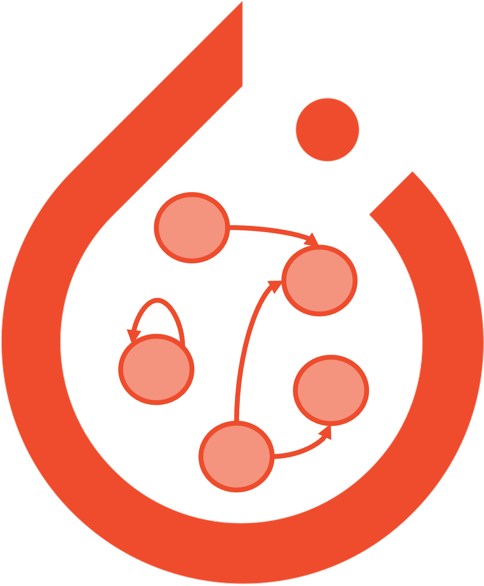

.. toctree::
   :maxdepth: 6
   :hidden:

   Overview <source/overview/index.rst>
   Reference <source/api/index.rst>

======================
**Welcome to TorchDyno**
======================
TorchDyno is a PyTorch-based library for the implementation of dynamical systems. It provides a simple and flexible way to build and train non-standard recurrent models, such as Reservoir Computing models. TorchDyno is designed to be easy to use, efficient, and flexible. It is built on top of PyTorch, which makes it easy to integrate with other PyTorch-based libraries.

.. grid:: 12

   .. grid-item::
      :columns: auto

      .. button-ref:: source/overview/index
         :ref-type: myst
         :outline:
         :class: start-button

         :octicon:`desktop-download;1em;info` Install

   .. grid-item::
      :columns: auto

      .. button-ref:: source/api/index
         :ref-type: myst
         :outline:
         :class: start-button

         :octicon:`book;1em;info` References

================
**Installation**
================
To install TorchDyno, you can use pip:

.. code-block:: bash

   pip install torchdyno

To install the latest version from the source code, you can clone the repository and install it using poetry as follows:

.. code-block:: bash

   git clone https://github.com/vdecaro/torchdyno
   cd torchdyno
   make setup

===========
**Credits**
===========
We thank [eclypse-org](https://github.com/eclypse-org) and [Jacopo Massa](https://github.com/jacopo-massa) for the structure and the template of the documentation!